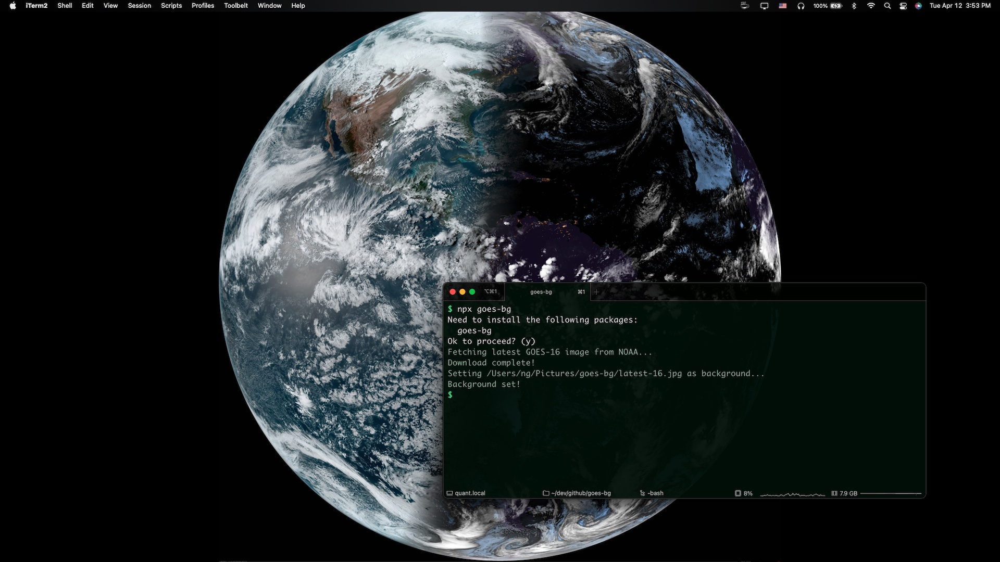

# goes-bg

> A small command line program to set your desktop background to the latest [Full Disk GeoColor](https://www.star.nesdis.noaa.gov/goes/fulldisk_band.php?sat=G16&band=GEOCOLOR&length=150) image from [GOES-16][16] and [GOES-17][17].

[GOES-16][16] and [GOES-17][17] are [geostationary](https://en.wikipedia.org/wiki/Geostationary_orbit) satellites operated by [NOAA](https://www.noaa.gov).

[16]: https://en.wikipedia.org/wiki/GOES-16
[17]: https://en.wikipedia.org/wiki/GOES-17

## Usage

```
npx goes-bg
```

### Satellites

#### [GOES-16][16] <em>(default)</em>

```
npx goes-bg -s 16
```



#### [GOES-17][17]

```
npx goes-bg -s 17
```


#### Help

```
goes-bg --help

Usage: goes-bg [options]

    --sat, -s             GOES Satellite to use (16 or 17). (default: 16)
    --outfile, -o         Location to save image. (default: ~/Pictures/goes-bg/latest.jpg)
    --help, -h            Show help.
```

## Support/Maintenance

This is released as-is as an experimental proof of concept, for educational purposes only. No support or maintenance, whether short-term, long-term, or otherwise, is planned on intended. Use at your own risk.

## License

Public Domain ([Creative Commons Zero v1.0 Universal](https://spdx.org/licenses/CC0-1.0.html))
